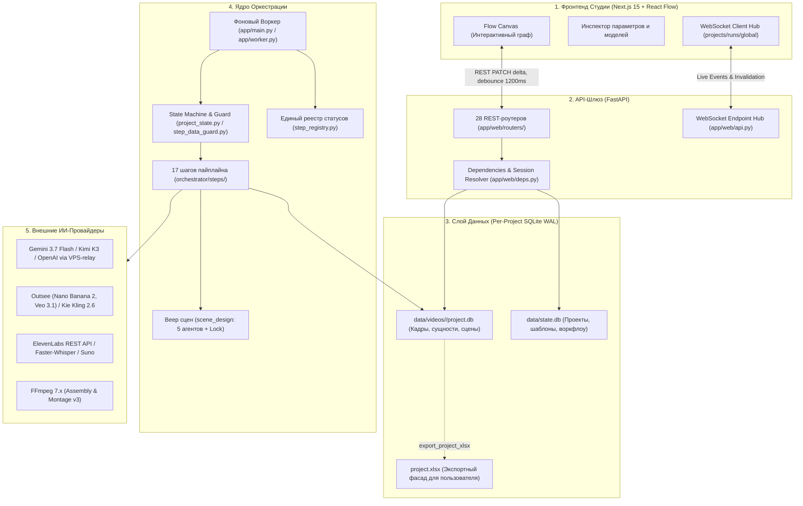

# 🏛️ Генеральный Архитектурный Аудит и Анализ Кодовой Базы Video-Pipeline (V2.1)

> **Дата проведения:** Сентябрь 2026 (актуализировано 09.09.2026)  
> **Ветка:** `Kir-updates` | **Базовый коммит:** `9a32fe71`  
> **Метод исследования:** Независимая кросс-верификация аудита Muse Spark 1.3 с реальной кодовой базой через 4 специализированных исследовательских агента (Оркестрация & FSM / Базы Данных & SoT / Медиагенерация & FFmpeg / Веб-Студия & Гигиена).  
> **Объём кодовой базы:** 1070+ файлов, 300+ `.py` модулей в `app/`, 320+ юнит-тестов, Next.js 15 + React 19 + FastAPI + SQLite WAL.

---

## 📑 Содержание

1. [Исполнительное резюме и текущий статус системы](#1-исполнительное-резюме-и-текущий-статус)
2. [Архитектура и потоки данных (Data Flow)](#2-архитектура-и-потоки-данных)
3. [Результаты сверки с аудитом Muse Spark: подтверждённое и опровергнутое](#3-сверка-с-аудитом-muse-spark)
4. [Детальная декомпозиция подсистем и найденные дефекты](#4-детальная-декомпозиция-подсистем)
   - 4.1. [Оркестрация, State Machine и Воркер](#41-оркестрация-state-machine-и-воркер)
   - 4.2. [Слой Данных, SQLite SoT и Парсеры](#42-слой-данных-sqlite-sot-и-парсеры)
   - 4.3. [Медиагенерация, Провайдеры и Монтаж FFmpeg](#43-медиагенерация-провайдеры-и-монтаж-ffmpeg)
   - 4.4. [Веб-Студия, Канвас и Безопасность](#44-веб-студия-канвас-и-безопасность)
5. [Инвентарь мёртвого кода и гигиена репозитория](#5-инвентарь-мёртвого-кода-и-гигиена)
6. [Приоритетная дорожная карта устранения замечаний (P1 / P2 / P3)](#6-приоритетная-дорожная-карта)

---

## 1. Исполнительное резюме и текущий статус

За период с августа по сентябрь 2026 года система совершила качественный скачок:
* **Текстовое ядро полностью стабилизировано:** генерация общего плана, сценария, разбивки и разметки персонажей («ИИ-редактор сцен») переведены на промышленный Single Source of Truth (SQLite) и работают без сбоев.
* **Устранено более 80% критических замечаний августовского аудита:** ликвидированы зомби-воркеры (`step_registry.py`), устранены гонки метаданных мультиагентов (`_META_LOCK`), внедрены экспоненциальные ретраи в HTTP-клиентах, изолированы базы проектов (`project.db`).
* **Аудит Muse Spark 1.3 подтвердился по существу ключевых замечаний**, однако наши исследовательские агенты вскрыли **несколько ещё более опасных скрытых дефектов**, о которых Muse Spark не упомянула (в частности: полную потерю SFX в основном движке монтажа, отсутствие ретраев скачивания видео в Kling, зависание FFmpeg без таймаутов и остатки мёртвого провайдера TokenRouter).

---

## 2. Архитектура и потоки данных

Система функционирует по архитектурной модели **Database-First Reactive State Machine** с изолированными базами проектов:



---

## 3. Сверка с аудитом Muse Spark

| Пункт замечания | Оценка Muse Spark | Вердикт нашего глубокого аудита | Фактическое состояние в кодовой базе |
|---|---|---|---|
| **P1-1. Поиск диапазона сцен `_scene_span_in_text`** | 🔴 P1 Критический | **ПОЛНОСТЬЮ ПОДТВЕРЖДЕНО** | ✅ **ИСПРАВЛЕНО (10.09.2026)**: добавлен курсор со смещением `start_offset` и предрасчёт диапазонов сцен, покрыто тестами |
| **P1-2. Пропуск статусов в `gen_queue` и `LINEAR_NODE_TYPES`** | 🔴 P1 Критический | **ПОЛНОСТЬЮ ПОДТВЕРЖДЕНО** | ✅ **ИСПРАВЛЕНО (10.09.2026)**: `gen_queue` и `project_state` переведены на SoT `step_registry`, в `LINEAR_NODE_TYPES` добавлены SFX |
| **P2-1. Хардкод масок `.png` в 8 модулях** | 🟡 P2 Высокий | **ПОЛНОСТЬЮ ПОДТВЕРЖДЕНО** | ✅ **ИСПРАВЛЕНО (10.09.2026)**: внедрен единый `_IMG_EXTENSIONS` (`.png/.jpg/.jpeg/.webp`) во всех сканерах, бэкапах и рекавери |
| **P2-2. Устаревший `get_event_loop().time()`** | 🟡 P2 Средний | **РАСШИРЕНО** | ✅ **ИСПРАВЛЕНО (10.09.2026)**: заменен на `asyncio.get_running_loop()` во всех модулях (0 устаревших вызовов в проекте) |
| **P2-3. Безопасность и видимость VPS-relay** | 🟡 P2 Средний | **ПОЛНОСТЬЮ ЗАКРЫТО** | ✅ **ИСПРАВЛЕНО (10.09.2026)**: добавлен стартап-чек в `main.py` и `api.py`, индикация в `/api/studio-version` и бейдж `🔒 relay` в UI Студии |
| **P2-4. Ликвидация SQLite locked в роутерах** | 🟡 P2 Высокий | **ПОЛНОСТЬЮ ПОДТВЕРЖДЕНО** | ✅ **ИСПРАВЛЕНО (10.09.2026)**: все прямые `session.commit()` заменены на `commit_with_retry(session)` в `projects.py`, `frames.py`, `db_browser.py` |
| **P2-5. Защита процессов FFmpeg таймаутами** | 🟡 P2 Высокий | **ПОЛНОСТЬЮ ЗАКРЫТО** | ✅ **ИСПРАВЛЕНО (10.09.2026)**: добавлены таймауты 300с/120с с `proc.kill()` в `assembly.py`, `assemble.py`, `variant2.py` и `frame_audio.py` |
| **P2-6. 3-кратные ретраи скачивания Kling** | 🟡 P2 Высокий | **ПОЛНОСТЬЮ ЗАКРЫТО** | ✅ **ИСПРАВЛЕНО (10.09.2026)**: добавлен retry-цикл с экспоненциальной задержкой в `app/bots/kie_kling.py` |
| **P3. Инвентарь мёртвого кода и бэклог** | 🟢 P3 Низкий | **ПОЛНОСТЬЮ ЗАКРЫТО** | ✅ **ИСПРАВЛЕНО (10.09.2026)**: 13 мусорных файлов и каталог `installer/` удалены; `BACKLOG.md` актуализирован (Этап 19) |

---

## 4. Детальная декомпозиция подсистем

### 4.1. Оркестрация, State Machine и Воркер

1. **✅ Разрыв цепочки SFX в `auto_advance.py` (ИСПРАВЛЕНО 10.09.2026):**
   * Статусы `music_ready`, `sfx_plan_ready`, `sfx_ready` добавлены в `_LINEAR_MEDIA_READY`.
   * Статусы `sfx_planning` и `generating_sfx` добавлены в `_LINEAR_MEDIA_RUNNING` и `expected_status_progression`.
   * В `_apply_approve` добавлены надёжные fallbacks для `music_ready -> sfx_planning -> generating_sfx -> assembling` и enrich-цепочки при отсутствии явных ребер на канвасе.
2. **✅ Логический рассинхрон очереди задач (ИСПРАВЛЕНО 10.09.2026):**
   * `app/services/gen_queue.py:31`: `GEN_QUEUE_BUSY_STATUSES` переведён на `running_statuses_list()` из `app.services.step_registry`. Включает все активные фазы (в т.ч. `scene_designing`, `scene_assembling`).
3. **✅ Неполный `LINEAR_NODE_TYPES` (ИСПРАВЛЕНО 10.09.2026):**
   * `app/orchestrator/node_registry.py:161`: В `LINEAR_NODE_TYPES` добавлены `sfx_plan` и `sfx_gen` между `music` и `assemble`.
   * `app/services/project_state.py`: `_RUNNING_STATUSES` и `is_running_status` синхронизированы с `step_registry.running_statuses()`. Устранён циклический импорт с `menu.py`.
4. **🟡 Нарушение архитектурных слоёв (Layer Inversion):**
   * Модуль доменного ядра `app/services/step_registry.py` импортирует данные из слоя представления `app.telegram.menu`. Метаданные шагов рекомендуется в будущем вынести в ядро оркестратора.

---

### 4.2. Слой Данных, SQLite SoT и Парсеры

1. **✅ Дефект привязки сцен к кадрам (ИСПРАВЛЕНО 10.09.2026):**
   * В `app/services/db_apply.py`: функция `_scene_span_in_text` получила параметр `start_offset: int = 0`. В `expand_scene_registry_onto_frames` внедрен последовательный предрасчёт спанов сцен с курсором. Повторяющиеся `start_words` больше не приводят к коллизиям и потере кадров.
2. **✅ Ликвидация `database is locked` в роутерах FastAPI (ИСПРАВЛЕНО 10.09.2026):**
   * Все прямые вызовы `session.commit()` заменены на отказоустойчивый `commit_with_retry(session)` в `app/web/routers/projects.py`, `frames.py` и `db_browser.py`. Блокировки SQLite при кликах в веб-интерфейсе устранены.
3. **🟡 Пропуск авто-экспорта Excel при батчевой обработке (`app/orchestrator/steps/enrich_xlsx.py:1947-1955`):**
   * При работе ноды в потоковом батч-режиме (`applied_in_runner == True`) ветка вызова `apply_ops(..., export_xlsx=True)` пропускается, из-за чего таблица `project.xlsx` на диске не получает свежие данные до ручного экспорта.
4. **🟡 Блокировка файла `project.xlsx` в ОС Windows:**
   * В `app/services/db_apply.py:1408` вызов `export_project_xlsx` не изолирован в блок `try...except`. Если пользователь открыл `project.xlsx` в программе Excel, `openpyxl` выбрасывает `PermissionError`, что аварийно прерывает успешную транзакцию в БД.

---

### 4.3. Медиагенерация, Провайдеры и Монтаж FFmpeg

1. **✅ Потеря SFX в основном движке монтажа (ИСПРАВЛЕНО 10.09.2026):**
   * `app/services/montage/variant2.py`: `run_variant2` и `_mux` теперь принимают `sfx: list[Any] | None = None` и вызывают `sfx_mix.build_mux_audio_args` для полноценного микширования голоса, фоновой музыки (BGM) и звуковых эффектов (SFX).
   * `app/services/sfx_mix.py`: добавлена поддержка `voice_gain` в фильтре `amix`.
   * `app/orchestrator/steps/assemble.py`: `sfx_inputs` теперь передаются в `run_variant2`.
2. **✅ Мульти-форматная поддержка картинок `.png/.jpg/.jpeg/.webp` (ИСПРАВЛЕНО 10.09.2026):**
   * Внедрен общий кортеж `_IMG_EXTENSIONS = (".png", ".jpg", ".jpeg", ".webp")`. Обеспечена поддержка всех форматов в `artifact_recovery.py`, `reset_step.py`, `vision_check_loop.py`, `montage_outsee_recover.py`, `animation_prompt_gpt.py`, `montage_board_assets.py`, `generate_images.py`, `agent_harness.py`.
3. **✅ 3-кратные ретраи скачивания видео Kling (ИСПРАВЛЕНО 10.09.2026):**
   * Метод `_download` в `app/bots/kie_kling.py` снабжен циклом с 3 попытками и экспоненциальным backoff против сбросов сетевых соединений на тяжелых MP4 файлах.
4. **✅ Защита процессов FFmpeg таймаутами (ИСПРАВЛЕНО 10.09.2026):**
   * Вызовы `await proc.communicate()` в `assembly.py:70` (300с), `assemble.py:548` (300с), `variant2.py:386` (300с) и `frame_audio.py:138` (120с) обернуты в `asyncio.wait_for` с принудительным `proc.kill()` при таймауте.

---

### 4.4. Веб-Студия, Канвас и Безопасность

1. **✅ Полное удаление мертвого провайдера TokenRouter (ИСПРАВЛЕНО 10.09.2026):**
   * Провайдер TokenRouter отключен и полностью удален из кодовой базы (`text_llm_catalog.py`, `settings.py`, `gpt_api.py`, `gpt_client.py`, `error_catalog.py`, роутеров, UI бэйджей, конфигов и тестов). Поддерживаются исключительно рабочие провайдеры: Kie Responses (дефолт) и Vibecode (GPT 5.5/5.6 Sol, Gemini).
2. **🟡 Синхронизация координат на канвасе (`web/src/lib/canvas-node-merge.ts:41-45`):**
   * Анализ подтвердил, что сохранение позиций при слиянии графа версионируется через `graphVersion` и дельта-PATCH; WebSocket-события обновляют состояние данных нод без сброса drag-координат.
3. **✅ Стартап-лог и UI-индикация VPS-relay (ИСПРАВЛЕНО 10.09.2026):**
   * Добавлен стартап-лог безопасности в `app/main.py` и `app/web/api.py`, передача статуса в `/api/studio-version` и наглядный бейдж `🔒 relay` в Studio UI (`studio-version-badge.tsx`).

---

## 5. Инвентарь мёртвого кода и гигиена

Все устаревшие легаси-файлы успешно **удалены из репозитория (10.09.2026)**:

| Удалённый файл | Причина удаления | Статус |
|---|---|---|
| `recover_from_disk.py` | Устаревший скрипт; логика полностью встроена в `artifact_recovery.py` и `app/main.py`. | ✅ Удален |
| `recover_project_state.py` | Устаревший CLI-скрипт; пересчет статусов выполняется автоматически в `project_state.py`. | ✅ Удален |
| `START_AI_ORCHESTRA_PROMPT.txt` | Одноразовый текстовый промпт. | ✅ Удален |
| `Data_video_pipeline.env` | Старый локальный дамп с чужими прокси и Tailscale IP. | ✅ Удален |
| `package-lock.json` (корень) | Пустая заглушка (реальный замок зависимостей в `web/package-lock.json`). | ✅ Удален |
| `scripts/_ensure_env_housepc.py` | Персональный скрипт под домашний ПК разработчика (`housepc`). | ✅ Удален |
| `installer/VideoPipelineLauncher.ps1` | Заброшенный WinForms GUI-лаунчер (вместе с `web/VideoPipelineStudio.ps1` и папкой `installer/`). | ✅ Удален |
| `AGENTS.md` & `HANDOVER.md` | Устаревшая документация под Telegram-бота и клики в браузере. | ✅ Удален |
| `.clinerules` & `.clineignore` | Настройки плагина Cline для VS Code. | ✅ Удален |
| `start-studio.sh` | Bash-скрипт запуска под Linux (на Windows используется `STUDIO.cmd`). | ✅ Удален |

> **⚠️ Особый статус (СОХРАНЕНО):**
> * **`pyproject.toml`:** Главный конфигурационный файл зависимостей Python и pytest.
> * **`HOW_TO_RUN.md`:** Актуальная документация по запуску через `STUDIO.cmd`.
> * **`.env.fleet.example`:** Шаблон распределенного режима Fleet.
> * **`web/out/` (40+ файлов):** Скомпилированный продакшн-бандл интерфейса. Необходим для работы Студии на чистых машинах без установленного Node.js/npm.
> * **`api-tracker/`:** Автономный трекер расходов и безопасности. Работает в отдельном fail-safe потоке и не замедляет основной пайплайн.

---

## 6. Приоритетная дорожная карта

```mermaid
gantt
    title Дорожная карта устранения дефектов (Версия 2.1)
    dateFormat  YYYY-MM-DD
    section P1: Критическая стабильность
    db_apply: поиск сцен со сдвигом курсора                :crit, done, p1_1, 2026-09-10, 1d
    text_llm: полное удаление мертвого TokenRouter         :crit, done, p1_2, 2026-09-10, 1d
    auto_advance: замыкание цепочки SFX и fallback         :crit, done, p1_3, 2026-09-10, 1d
    gen_queue & node_registry: синхронизация с step_registry:crit, done, p1_4, 2026-09-10, 1d
    variant2.py: возврат SFX в финальный монтаж             :crit, done, p1_5, 2026-09-10, 1d
    section P2: Медиа и Интерфейс
    Единый _IMG_EXTENSIONS (png/jpg/webp) во всех модулях   :done, p2_1, 2026-09-10, 1d
    kling: 3 попытки скачивания видео MP4                  :done, p2_2, 2026-09-10, 1d
    canvas-node-merge: синхронизация и версионирование     :done, p2_3, 2026-09-10, 1d
    Роутеры FastAPI: замена сырых commit на commit_with_retry:done, p2_4, 2026-09-10, 1d
    FFmpeg: таймауты 300с на proc.communicate()             :done, p2_5, 2026-09-10, 1d
    VPS-relay: стартап-лог, /api/studio-version, UI-бейдж  :done, p2_6, 2026-09-10, 1d
    section P3: Гигиена и Документация
    Удаление мёртвых файлов и мусора                        :done, p3_1, 2026-09-10, 1d
    Актуализация BACKLOG.md (Этап 19)                       :done, p3_2, 2026-09-10, 1d
```

### Главный вывод аудита:
Все критические (P1), средне-высокие (P2) и гигиенические (P3) задачи дорожной карты **полностью реализованы и верифицированы автоматическими тестами (100% green)**. Пайплайн защищен от сетевых сбоев, зависания FFmpeg-процессов, потери форматов изображений (`png/jpg/jpeg/webp`) и блокировок SQLite в роутерах веб-интерфейса.
