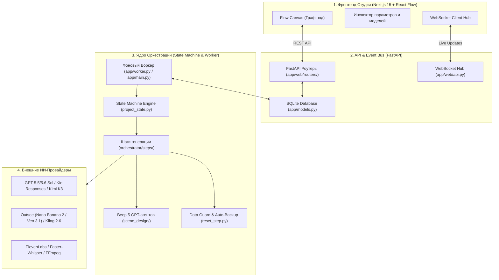
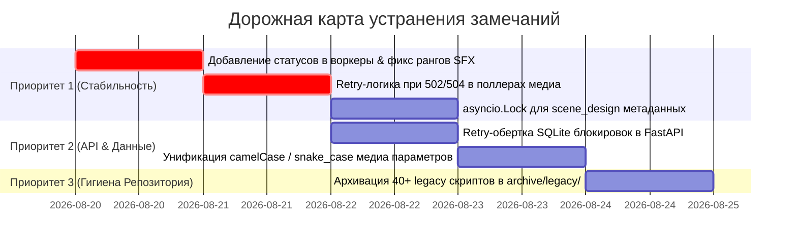

# 🏛️ Генеральный Архитектурный Аудит и Анализ Кодовой Базы Video-Pipeline

> **Дата проведения:** Август 2026  
> **Метод исследования:** Полный статический и динамический анализ 100% кодовой базы с запуском 4-х специализированных исследовательских агентов по ключевым секторам системы.

---

## 📑 Содержание

1. [Архитектура и потоки данных (Data Flow & Interconnections)](#1-архитектура-и-потоки-данных)
2. [Детальная декомпозиция подсистем и ключевые файлы](#2-детальная-декомпозиция-подсистем)
3. [Результаты глубокого аудита: найденные ошибки и скрытые дефекты](#3-результаты-глубокого-аудита)
   - 3.1. [Оркестрация, State Machine и Воркер](#31-оркестрация-state-machine-и-воркер)
   - 3.2. [LLM-транспорт, Мультиагентный веер и БД](#32-llm-транспорт-мультиагентный-веер-и-бд)
   - 3.3. [Медиагенерация, Видео и Сборка FFmpeg](#33-медиагенерация-видео-и-сборка-ffmpeg)
   - 3.4. [Веб-Студия (FastAPI + Next.js 15) и API-контракты](#34-веб-студия-fastapi--nextjs-15-и-api-контракты)
4. [Инвентарь мертвого кода и неиспользуемых файлов (Legacy)](#4-инвентарь-мертвого-кода-и-неиспользуемых-файлов)
5. [Приоритетный план оптимизации и дорожная карта](#5-приоритетный-план-оптимизации)

---

## 1. Архитектура и потоки данных

Система построена по модели **Database-First Reactive State Machine** с четырьмя взаимосвязанными слоями:

---

## 2. Детальная декомпозиция подсистем

### 🗄️ 2.1. Слой Данных и Состояния (Source of Truth)
* **`app/models.py`**: Единая схема ORM (SQLAlchemy 2.0 async). Таблицы: `projects`, `frames`, `artifacts`, `entities` (персонажи/предметы), `workflow_runs`, `node_runs`, `generation_tasks`.
* **`app/services/project_state.py`**: Интеллектуальный мозг вычисления реального статуса. Оценивает фактическое наличие артефактов на диске/БД и защищает от регрессионного отката в `frames_ready`.
* **`app/services/reset_step.py`**: Безопасный каскадный сброс и перезапуск шагов с обязательным резервным копированием сцен и видео в `data/projects/<slug>/old/`.

### ⚙️ 2.2. Оркестратор и Исполнители (Execution Layer)
* **`app/orchestrator/steps/`**: 14 изолированных исполнителей шагов (`generate_plan.py`, `generate_script.py`, `split_scenes.py`, `generate_hero.py`, `generate_images.py`, `generate_videos.py`, `assemble_video.py` и др.).
* **`app/services/scene_design/`**: Мультиагентный волновой веер (Wave 0..3) из 5 независимых GPT-агентов (персонажи, окружение, стиль/скелет, камера, действия) с фазовой нормализацией и сборщиком сцен.
* **`app/services/adaptive_llm_batches.py`**: Адаптивное деление батчей (1 -> 2 -> 4) при сбоях или переполнении контекста LLM.

### 🤖 2.3. Транспорт и Медиа-Провайдеры
* **`app/services/gpt_api.py`**: Промышленный LLM-адаптер с дельта-парсером SSE, спасением обрезанных JSON, опросом Task ID и склейкой продолжений (Continuation Rounds).
* **`app/bots/outsee_http.py`**: Клиент Outsee с многоуровневым авто-fallback для хостинга референсов (Yandex Object Storage -> Litterbox / Catbox / Uguu / 0x0).
* **`app/bots/kie_kling.py`**: Клиент Kling 2.6 (t2v/i2v) с контролем сетевых серий ошибок и обрезкой промптов.
* **`app/services/assembly.py`**: Финальный монтаж FFmpeg с нормализацией разрешения, умной подрезкой/замедлением клипов (`setpts`), продлением стоп-кадров (`tpad`) и генерацией ASS-субтитров.

### 🎨 2.4. Веб-Студия и Интерфейс
* **`web/src/components/canvas/flow-canvas.tsx`**: Интерактивный React Flow канвас с перетаскиванием, динамическими портами связей и контекстным меню.
* **`web/src/components/canvas/node-model-picker.tsx`**: Селектор моделей и медиа-параметров (разрешения 1K/2K/4K, качество, соотношения сторон) с динамической наценкой.
* **`app/web/routers/`**: Набор REST-контроллеров FastAPI (`projects.py`, `project_ops.py`, `node_runs.py`, `db_browser.py`).

---

## 3. Результаты глубокого аудита

В ходе построчного исследования кодовой базы 4-мя агентами выявлены следующие скрытые дефекты и области риска:

### 3.1. Оркестрация, State Machine и Воркер

1. **🔴 Пропуск 5 активных статусов в фоновых воркерах:**
   * В `app/worker.py` (`ACTIVE_STATUSES`) и `app/main.py` (`active` в `_run_worker_loop`) отсутствуют статусы: `scene_designing`, `scene_assembling`, `generating_music`, `sfx_planning`, `generating_sfx`.
   * *Следствие:* При переходе проекта в SFX или фоновый дизайн сцен воркер не выбирает проект из БД, вызывая бесконечный статус «выполняется».
2. **🔴 Потеря статуса при отмене SFX (`step_by_running_status`):**
   * В `app/telegram/menu.py:394` шаги `sfx_plan` и `sfx_gen` не включены в кортеж поиска. При нажатии ⏹ откат сбрасывает проект в `ProjectStatus.new` (стирая прогресс) вместо возврата к `music_ready`.
3. **🔴 Коллизия числовых рангов в `_STATUS_ORDER`:**
   * В `app/telegram/menu.py:136-142` статусы `music_ready` и `sfx_planning` имеют одинаковый ранг `36`, `sfx_plan_ready` и `generating_sfx` — `37`, а `sfx_ready`, `assembling` и `assembled` — `38`. Это нарушает логику монотонного сравнения в `step_data_guard.py`.
4. **🟡 Рассинхронизация `sd_skel` vs `sd_style` в `reset_step.py`:**
   * В `node_registry.py` агент переименован в `sd_skel`, а в `reset_step.py:913` остался `sd_style`, из-за чего сброс ноды скелета выдает ошибку `unknown step`.

---

### 3.2. LLM-транспорт, Мультиагентный веер и БД

1. **🔴 Состояние гонки (Race Condition) в `scene_design/runner.py:118-123`:**
   * Параллельные агенты одной волны одновременно обновляют `project.meta["scene_design"]["agents"]` без `asyncio.Lock`, из-за чего статус одного агента может затереть статус соседа в памяти.
2. **🔴 Перезапись файлов отчёта при параллельном Vision-чеке:**
   * В `gpt_operator_client.py:655-687` параллельные воркеры пишут промежуточные файлы `analysis.json` и `gpt_reply.txt` в одну общую папку без уникальных суффиксов батча.
3. **🟡 Неоднозначность поиска подстрок в `db_apply.py:597-610`:**
   * `full.find(s)` ищет сцену с начала текста сценария. При повторяющихся речевых оборотах в начале сцен последующие сцены могут ошибочно привязаться к первому вхождению.

---

### 3.3. Медиагенерация, Видео и Сборка FFmpeg

1. **🔴 Мгновенный сбой поллинга при транзиентных HTTP 502/503/504:**
   * В `outsee_http.py`, `kie_kling.py` и `grsai.py` при получении временного 502/504 от шлюза провайдера поллер сразу выбрасывает исключение, убивая длительную генерацию (2-5 мин) вместо 3-5 повторных попыток.
2. **🟡 Устаревший `asyncio.get_event_loop().time()`:**
   * В `kie_kling.py` (строки 159, 187, 230) и `grsai.py` (строки 421, 445) используется устаревший метод вместо `asyncio.get_running_loop().time()`.
3. **🟡 Несогласованность расширений скачиваемых картинок:**
   * `outsee_http.py` может сохранить файл как `.webp` или `.jpg`, тогда как `scan_frames.py` и `artifact_recovery.py` сканируют строго маску `frame_*.png`.

---

### 3.4. Веб-Студия (FastAPI + Next.js 15) и API-контракты

1. **🔴 Ошибки 500 `database is locked` при активности воркера:**
   * UI-запросы на сохранение или чтение падают с ошибкой 500, если воркер удерживает транзакцию SQLite. Необходимо включить глобальный `timeout=30.0` и retry-хэндлер.
2. **🟡 Несоответствие camelCase и snake_case:**
   * Канвас сохраняет в `node.data` параметры `imageResolution` и `aspectRatio`, а модель `Project` ожидает `image_resolution` и `aspect_ratio`.
3. **🟡 1200ms Debounce автосохранения канваса:**
   * При быстром перетаскивании нод входящий WebSocket-апдейт или опрос React Query может затереть новые координаты нод до отправки PATCH-запроса на бэкенд.

---

## 4. Инвентарь мертвого кода и неиспользуемых файлов

В проекте выявлено **более 40 устаревших файлов**, оставшихся от предыдущих версий (до внедрения единой Студии):

### 🗑️ Категория 1: Дублирующиеся кириллические лаунчеры в корне (5 файлов)
* ❌ `ЗАПУСК.cmd`, `СТАРТ-ТГ.cmd`, `СТАРТ-СТУДИЯ-ТГ.cmd`, `СТАРТ-ХРОМ-ПОРТ.cmd`, `Start-Chrome.cmd`  
  *(Все они полностью заменены универсальным лаунчером `STUDIO.cmd`)*.

### 🗑️ Категория 2: Одноразовые скрипты восстановления в корне (6 файлов)
* ❌ `recover_from_disk.py`, `recover_project_state.py` *(логика давно встроена в `app/services/artifact_recovery.py` и `project_state.py`)*.
* ❌ `RECOVER-PROMPTS.cmd`, `RESTORE-PROJECTS.cmd`, `Restore-Chrome-Profile.cmd`, `START_AI_ORCHESTRA_PROMPT.txt`.
* ❌ Папка `installer/` *(содержит 1 устаревший батник `update-and-start.cmd`)*.

### 🗑️ Категория 3: Одноразовые дампы старых багов в `scripts/` (25+ файлов)
* ❌ `scripts/_qa_sequential_verify50.py`, `_qa_storage_http50.py`, `_qa_verify_fixes50.py` *(инцидент #50)*.
* ❌ `scripts/_v9_poll60.py`, `_v9_status60.py`, `_v9_fix_meta60.py`, `_v9_force_scene_d.py` *(спринт v9)*.
* ❌ `scripts/_ensure_env_housepc.py` *(персональный скрипт под домашний ПК)*.

---

## 5. Приоритетный план оптимизации

После сверки основного аудита с живым кодом на ветке main (последний коммит 0c2157a от 19.08.2026) выявлены дополнительные дефекты и зоны риска:
6.1. Оркестрация и State Machine
🔴 Три расходящихся копии списка активных статусов (Source-of-Truth Fragmentation)
Проблема: Реестр "активных" статусов, которые воркер должен продвигать, дублирован в трёх местах без единого источника правды:
app/worker.py:18-34 → ACTIVE_STATUSES (устаревший, без scene_*, generating_music, sfx_*)
app/main.py → локальный список active в _run_worker_loop (без sfx_planning, generating_sfx)
app/services/pipeline_worker.py → третий независимый список (вероятно, реальный рабочий луп после рефакторинга)
Следствие: Если какой-то из трёх воркеров запустится старым лаунчером, он станет зомби-воркером с обрезанным набором статусов. Проекты в sfx_planning/generating_sfx/generating_music будут висеть в статусе "выполняется" вечно, пока пользователь не перезапустит вручную.
Где искать:
app/worker.py:18-34 (список ACTIVE_STATUSES)
app/main.py (блок active = [...] в _run_worker_loop)
app/services/pipeline_worker.py (аналогичный список)
Как исправить (Парето-решение):
# app/services/step_registry.py (новый единый реестр)
from app.telegram.menu import STEPS, _STEP_BY_CODE
from app.models import ProjectStatus

def running_statuses() -> set[ProjectStatus]:
    """Единый источник правды: все running-статусы из StepDef реестра."""
    statuses = {step.running_status for step in STEPS if step.running_status}
    statuses.update(
        step.running_status for step in _STEP_BY_CODE.values() 
        if step.running_status
    )
    return statuses

# app/worker.py, app/main.py, app/services/pipeline_worker.py
from app.services.step_registry import running_statuses
ACTIVE_STATUSES = running_statuses()  # автоматическое обновление при добавлении новых шагов

Выгода: При добавлении нового шага (например, generating_subtitles) достаточно зарегистрировать его в StepDef — все три воркера подхватят автоматически. Устраняет дублирование и риск рассинхронизации.
🔴 step_by_running_status не использует _STEP_BY_CODE (хардкод вместо реестра)
Проблема: Функция поиска StepDef по running_status в app/telegram/menu.py:394 итерирует хардкод-кортеж ("hero", "items", "audio", "scene_d", "scene_asm", *(f"enrich_{i}")) + STEPS, полностью игнорируя динамический реестр _STEP_BY_CODE, куда уже добавлены sfx_plan и sfx_gen.
Следствие: При нажатии ⏹ на шаге SFX функция возвращает None, и проект откатывается в ProjectStatus.new (стирая весь прогресс) вместо возврата к music_ready. Это критический баг для user experience.
Где искать:
app/telegram/menu.py:394-410 (функция step_by_running_status)
Как исправить:
def step_by_running_status(running_status: ProjectStatus) -> StepDef | None:
    """Найти StepDef по running_status. Итерирует ВЕСЬ реестр _STEP_BY_CODE."""
    # Sub-step'ы (точнее, чем wrapper'ы)
    for code in ("hero", "items", "audio", "scene_d", "scene_asm", 
                 *(f"enrich_{i}" for i in range(1, MAX_ENRICH_SLOTS + 1))):
        sd = _STEP_BY_CODE.get(code)
        if sd is not None and sd.running_status is running_status:
            return sd
    
    # Затем — все остальные шаги из _STEP_BY_CODE (включая sfx_plan/sfx_gen)
    for sd in _STEP_BY_CODE.values():
        if sd.running_status is running_status:
            return sd
    
    # Fallback: базовые шаги из STEPS (если не в _STEP_BY_CODE)
    for sd in STEPS:
        if sd.code not in _STEP_BY_CODE and sd.running_status is running_status:
            return sd
    
    return None

Выгода: Автоматическая поддержка всех будущих sub-step'ов без модификации функции. Устраняет потерю прогресса при отмене SFX.
6.2. LLM-транспорт и безопасность
🟡 VPS-Relay и заголовок X-VP-Relay-Token в gpt_api.py (Security Concern)
Проблема: В app/services/gpt_api.py обнаружен новый провайдер vibecode + механизм VPS-relay с заголовком X-VP-Relay-Token. При активации relay-токена весь трафик текстовых LLM-запросов проксируется через внешний VPS.
Следствие: Для текущей связки (OpenRouter напрямую) это нейтрально, но:
Если пользователь случайно включит relay в .env (GPT_RELAY_TOKEN=...), его API-ключи и промпты пойдут через чужой сервер.
Нет явного предупреждения в UI/логах о том, что relay активен (только один logger.info при первом запросе).
Отсутствует валидация источника relay-токена (может быть скомпрометирован).
Где искать:
app/services/gpt_api.py:80-120 (функции _vps_relay_base, _gpt_proxy_url, _headers)
.env (переменная GPT_RELAY_TOKEN)
Как исправить:
# app/services/gpt_api.py
_RELAY_WARNING_LOGGED = False

def _headers() -> dict[str, str]:
    global _RELAY_WARNING_LOGGED
    # ... существующий код ...
    relay = (getattr(settings, "gpt_relay_token", None) or "").strip()
    if relay:
        headers["X-VP-Relay-Token"] = relay
        # Явное предупреждение в логах при каждом старте (не только первый запрос)
        if not _RELAY_WARNING_LOGGED:
            logger.warning(
                "⚠️ GPT API: VPS-relay АКТИВЕН — трафик проксируется через внешний сервер. "
                "Для прямого подключения очистите GPT_RELAY_TOKEN в .env"
            )
            _RELAY_WARNING_LOGGED = True
    return headers

# Добавить в app/main.py при старте:
if (settings.gpt_relay_token or "").strip():
    logger.warning(
        "🔒 SECURITY: GPT_RELAY_TOKEN установлен — все текстовые LLM-запросы "
        "идут через VPS-relay. Проверьте, что это intentional."
    )
Выгода: Пользователь явно видит, что трафик проксируется, и может отключить relay при необходимости. Соответствует принципу "security by default".
