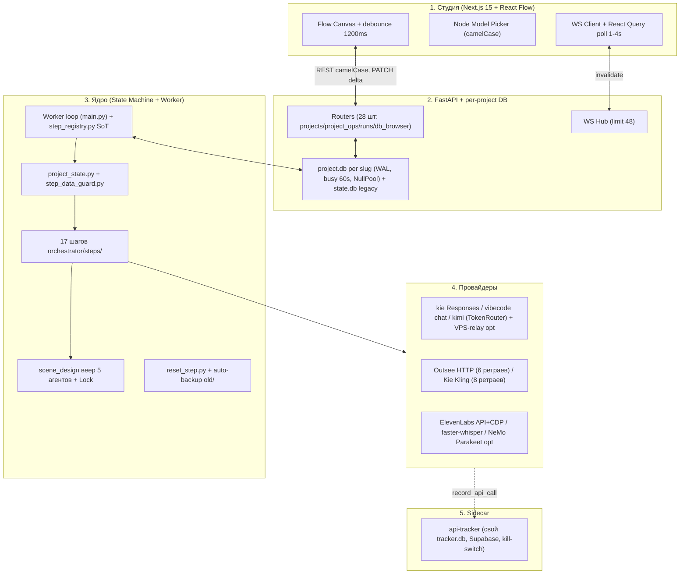

# 🏛️ Архитектурный Аудит Video-Pipeline — Сентябрь 2026 (V2)

> **Дата проведения:** 09.09.2026
> **Коммит:** `main@23b0b7d1` (Fix БД, PR #310)
> **Метод:** сверка `ARCHITECTURE_AUDIT.md` (август 2026) с живым кодом + полный обход 4-мя исследовательскими агентами (оркестрация / LLM+БД / медиа+FFmpeg / веб+гигиена). Проверено построчно: `step_registry.py`, `menu.py`, `project_state.py`, `gen_queue.py`, `db_apply.py`, `db.py`, `project_db.py`, `gpt_api.py`, `outsee_http.py`, `kie_kling.py`, `artifact_recovery.py`, `flow-canvas.tsx`.
> **Масштаб:** 1071 файл, 306 `.py` в `app/`, 326 тестов, Next.js 15 + React 19 + FastAPI.

---

## 📑 Содержание

1. [Архитектура и потоки данных](#1-архитектура-и-потоки-данных)
2. [Декомпозиция подсистем](#2-детальная-декомпозиция-подсистем)
3. [Сверка со старым аудитом: что закрыто](#3-сверка-со-старым-аудитом-что-закрыто)
4. [Текущие проблемы (новые)](#4-текущие-проблемы)
5. [Мертвый код и гигиена](#5-инвентарь-мертвого-кода)
6. [План оптимизации](#6-приоритетный-план)

---

## 1. Архитектура и потоки данных

Модель прежняя — **Database-First Reactive State Machine**, но с двумя крупными сдвигами с августа: **per-project SQLite** и **api-tracker как sidecar**.



Ключевое отличие от августовской схемы: нет единого `state.db` для всего — `app/project_db.py` держит LRU-пул движков `data/videos/<slug>/project.db`, роутинг в `app/web/deps.py:37-182`. `app/db.py:23-39` — `timeout=60`, `WAL`, `busy_timeout=60000`, `commit_with_retry x5`.

---

## 2. Детальная декомпозиция подсистем

### 🗄️ 2.1. Данные и состояние
- `app/services/step_registry.py:8-27` — **новый единый реестр** `running_statuses() / running_statuses_list()`. Единственный SoT для воркеров.
- `app/telegram/menu.py:99-147` — `_STATUS_ORDER` строго монотонен 0..44 (`music_ready:36 → sfx_planning:37 → sfx_plan_ready:38 → generating_sfx:39 → sfx_ready:40 → assembling:41`). `step_by_running_status:385-415` итерирует `_STEP_BY_CODE`, включая `sfx_plan/sfx_gen`.
- `app/services/project_state.py:342-784` — `compute_actual_status` снизу-вверх + `recompute_status` (пропуск running/paused/failed, BLOCKED `*→new` при живых кадрах, `refresh` против гонки со ⏹).
- `app/services/step_data_guard.py:69-456` — зеркальные `ready_status_confirmed_by_data / can_enter_running / clamp_status_to_data`.
- `app/services/reset_step.py:905-1123` — каскад `reversed(_PIPELINE_RESET_LEVELS)` + пересчет через `compute_actual_status`.
- `app/project_db.py` (731 строка) + `app/db.py:47-76` — per-project изоляция + retry на `locked/busy`.

### ⚙️ 2.2. Оркестратор
- `app/orchestrator/steps/` — 17 модулей: `make_plan/make_script/split_frames/scene_design/generate_hero/generate_items/enrich_xlsx/generate_image_prompts/generate_images/make_animation_prompts/generate_videos/generate_audio/generate_music/plan_sfx/generate_sfx/assemble/publish`. Диспетчер `pipeline.py:134-185` покрывает все 22 running-статуса; `auto_advance.py:103-206 TRANSITIONS` полон (`music_ready→sfx_planning`, `sfx_ready→assembling`).
- `app/services/scene_design/runner.py:22-23,115-137,733-734` — `_META_LOCK (asyncio) + _SYNC_META_LOCK (RLock)`, per-agent чекпоинты `scene_design/<agent>.json`.
- `app/services/adaptive_llm_batches.py:12-31` — `NEXT_SPLIT={1:2,2:4}`, потребитель `_chat_adaptive_1_2_4` в `gpt_api.py:2097-2211`.

### 🤖 2.3. Транспорт и медиа
- `app/services/gpt_api.py` (2600+ строк) — два SSE-парсера (`parse_responses_sse_lines:1138-1241`, `parse_chat_completions_sse_lines:1762+`), `looks_truncated/stitch:1350-1395`, continuation rounds x2 (`2332-2407`, `2434-2495`), `_stream_timeout + _sse_deadline_s:1069-1102`, VPS-relay `_vps_relay_base:148-149`, `_headers:203-234` с `X-VP-Relay-Token` + `SECURITY NOTICE:249-258`.
- `app/bots/outsee_http.py:308-380` — `_poll_generation`, `transient 5xx streak ≤6`, сетевые retry до deadline 600с. Fallback хостинга `ensure_public_image_url:766-887` — `[yandex?] → uguu/litterbox/catbox/0x0` с verify.
- `app/bots/kie_kling.py:327-421` — `_poll_task`, transient/network streak ≤8, deadline 900с. `grsai` удален (см. BACKLOG:183).
- `app/services/assembly.py:76-343` — канон: `setpts`-замедление, `scale/pad/setsar`, `tpad`-хвост, `concat + libx264/crf20`, mux голос+BGM+SFX, ASS-burn. `app/services/montage/` — вариант 3 (slot+concat, ping-pong вместо freeze, `MONTAGE_ENGINE_V2`).
- Озвучка: `frame_audio.py:509-526` (ElevenLabs API → CDP-фолбэк), `whisper.py` (faster-whisper), `asr.py` (NeMo Parakeet при `ASR_BACKEND=nvidia`). `edge-tts` в `app/` не найден (0 хитов).

### 🎨 2.4. Веб-студия
- `app/web/routers/` — 28 файлов (`projects/project_ops/runs/workflows/db_browser/outsee_create/meta_agent/...`). `node_runs.py` из старого аудита не существует.
- `web/src` — Next 15.5.4, React 19.1, xyflow 12, react-query 5, zustand 5, Tailwind 4. `web/out/` — 40 файлов закоммичены осознанно (`web/.gitignore` игнорит только `.next/`). `web/STUDIO_VERSION` (506 / 2a1c125b), `/api/studio-version (api.py:362-366)` + бейдж stale.
- Канвас end-to-end camelCase (`node-model-picker:43-49`, `workflowNodeFromCanvas:64-76`, `flow-canvas:616-655`); camel→snake только на границе `CreateProjectRequest (schemas.py:105-121)`. Debounce 1200мс `flow-canvas:423-432` + очередь persist `488-498` + дельта-PATCH `564-576` + merge `canvas-node-merge.ts` + `graphVersion` без `saved_at`.
- `tests/` — 326 файлов, `conftest.py:25-33` изолирует `data_dir/sqlite` в tmp, `.env` не нужен.

---

## 3. Сверка со старым аудитом: что закрыто

| Пункт августа | Статус 09.09 | Доказательство |
|---|---|---|
| 3.1.1 / 6.1 пропуски ACTIVE_STATUSES, 3 воркера-зомби | ✅ Закрыт | `step_registry.py:8-27`, `worker.py:29-31`, `main.py:307-309`, третьего списка в `pipeline_worker.py` нет |
| 3.1.2 / 6.1 потеря SFX при ⏹ | ✅ Закрыт | `menu.py:398` кортеж включает `sfx_plan/sfx_gen` + проход `_STEP_BY_CODE:404-406`; `project_control.py:230-235` откат в `music_ready/sfx_plan_ready` |
| 3.1.3 коллизия рангов 36/37/38 | ✅ Закрыт | `menu.py:99-147` монотонно 35..44 |
| 3.1.4 `sd_skel vs sd_style` | ✅ Закрыт | `node_registry.py:134-141`, `reset_step.py:905-933`; `sd_style` только в комментарии |
| 3.2.1 race `runner.py:118-123` | ✅ Закрыт | `_META_LOCK:22`, `_update_meta_state:122-130`, `async with _META_LOCK:733-734` |
| 3.2.2 перезапись `analysis.json/gpt_reply.txt` | ✅ Закрыт | `batch_node_key __b{bi}:674`, per-batch `out_dir:303`, merge `783-798` |
| 3.3.1 сбой 502/503/504 | ✅ Закрыт | Outsee 6 ретраев, Kling 8 ретраев; `grsai` удален |
| 3.3.2 `get_event_loop().time()` в kling/grsai | ✅ Частично | В `outsee_http:311,318` и `kie_kling:329-416` заменен; остался в legacy-ботах (см. §4) |
| 3.3.3 маска `frame_*.png` | ✅ На горячем пути | `scan_frames.py:40-70`, `plan_shot2.py:113-166`, `ensure_frames_from_disk` — 4 расширения; хвосты остались (см. §4) |
| 3.4.1 `database is locked` | ✅ Решен иначе | `timeout=60 + WAL + busy 60s + retry x5 + per-project DB`; глобальный `timeout=30` не нужен |
| 3.4.2 camel/snake | ⚠️ Переформулирован | Маппинг есть на `CreateProjectRequest`; ноды осознанно camel в `meta.canvas_graph` |
| 3.4.3 debounce затирает координаты | ⚠️ Смягчен | Merge + версионирование + дельта-PATCH; polling+WS остались |
| Раздел 4: 40+ legacy | ✅ В основном вычищен | Кириллические `.cmd`, `_qa_*`, `_v9_*` удалены; остаток ~5 файлов (см. §5) |
| 6.2 VPS-relay без предупреждения | ⚠️ Частично | `SECURITY NOTICE:249-258` есть, но once-per-process, без стартап-чека и UI-индикатора |

---

## 4. Текущие проблемы

### 🔴 P1 — логика и данные

**P1-1. `db_apply._scene_span_in_text` — неверная привязка сцен (единственный живой красный баг из старого аудита).**
Где: `app/services/db_apply.py:620-632` (`i0=full.find(s)`, `i1=full.find(e,i0)`), потребитель `expand_scene_registry_onto_frames:635-675` (`if b>s0 and a<s1: append; break`).
Следствие: при повторяющемся обороте в `start_words` все последующие сцены тянутся к первому вхождению; порядок `scenes[]` решает вместо ближайшего вхождения. Компенсации (`689-708` dedupe, `746-796` 1-shot-1-frame) не лечат корень.
Фикс (Парето): искать от конца предыдущей сцены / ближайшее вхождение после курсора + проверка `count>1 → warning + fallback на уже записанный attrs[shot01_id_scene]`; добавить тест с дублирующимся `start_words`.

**P1-2. Новая фрагментация SoT: очередь и граф не знают scene/SFX.**
Где: `app/services/gen_queue.py:31-52 GEN_QUEUE_BUSY_STATUSES` (20 шт, нет `scene_designing`, `scene_assembling`); `app/orchestrator/node_registry.py:161-182 LINEAR_NODE_TYPES` (нет `sfx_plan/sfx_gen`); рядом `app/services/project_state.py:41-64 _RUNNING_STATUSES` (полные 22, но второй SoT вместо импорта `step_registry`).
Следствие: при `WORKER_MAX_PARALLEL>1` scene-шаги не считаются busy (окно очереди врет); линейный граф молча пропускает SFX-ноды.
Фикс: `GEN_QUEUE_BUSY_STATUSES = list(running_statuses())` (или `running_statuses_list()`), `LINEAR_NODE_TYPES += sfx`, `_RUNNING_STATUSES` удалить в пользу `from app.services.step_registry import running_statuses`.

### 🟡 P2 — медиа-хвосты и транспорт

**P2-1. PNG-only хвосты проиграют на `.jpg/.webp` от Outsee.**
Сохраняет: `outsee_http.py:1137-1140` (`{png,jpg,jpeg,webp}`), `generate_images.py:1555-1560` просит `.png` но переименовывается под URL.
Строго `.png`: `artifact_recovery.py:276,288,644`, `reset_step.py:629,672`, `vision_check_loop.py:321,326,334`, `montage_outsee_recover.py:84,435`, `animation_prompt_gpt.py:116`.
Фикс: вынести `_IMG_EXTENSIONS={png,jpg,jpeg,webp}` в общий хелпер (как в `plan_shot2.py:113`) и заменить все `glob("*.png"/"frame_*.png")`.

**P2-2. `asyncio.get_event_loop().time()` жив в legacy-ботах.**
Где: `chatgpt.py (~30 мест: 619,843,910...)`, `outsee.py (146,1869,2815...)`, `elevenlabs.py:220,764`, `kie_http.py:281,292,325`, `publishers.py:62`. В живых поллерах уже `get_running_loop`.
Фикс: механическая замена `get_event_loop().time()` → `get_running_loop().time()` + `ruff` правило.

**P2-3. VPS-relay: предупреждение есть, но слабое.**
Где: `gpt_api.py:130,233,238-258` (once-per-process warning), `settings.py:140-142,189-198`.
Нет: стартап-чека в `main.py`, UI-бейджа, валидации источника токена. Докстринг `outsee_http.py:772-778` про «хосты отключены» устарел (код их использует).
Фикс: warning при старте + `docs` + пометка в `/api/studio-version` (`via=vps-relay` уже есть в `2255-2276`, показать в UI).

**P2-4. Канвас: гонка polling+WS не снята, только смягчена.**
Где: `flow-canvas.tsx:155-184` (poll project 1/2.5с, run 4с, WS invalidate), persist `423-498,564-598`, merge `canvas-node-merge.ts:42-44`.
Риск: быстрый drag между тиками + входящий invalidate. Прямые `session.commit()` без retry в части роутеров (`projects.py:ensure-run/delete`) + общий `state.db` через `get_session` — остаточный `locked`.
Фикс: перевести все записи на `commit_with_retry`/`session_scope`, `DELETE` per-project engine уже есть (`projects.py:304-310`) — расширить на остальные мутации; рассмотреть `graphVersion` с `saved_at` или ETag.

### 🟢 P3 — дрейф доков и каталоги

- `HANDOVER.md` про `devin/windows-installer` + file-share — канон теперь `main`; `main — старый skeleton` неверно.
- `ARCHITECTURE_AUDIT.md:70` упоминает таблицу `generation_tasks` — `grep` по `app/` пуст (есть `WorkflowRun/NodeRun`, `Scene/FrameText/PromptVersion/FrameEdge/SceneDesignCell` в `models.py:215-824`).
- `text_llm_catalog.py:183` `write_choice` кидает на `tokenrouter`, хотя `resolve_active_provider:203-216` и `settings.py:87-96` его считают валидным.
- `BACKLOG.md` 48КБ — переполнен; часть пунктов (`TR-01` retry, `IMG-01` мульти-расширения, `GRSAI-01` удаление) по факту закрыта, но висит.

---

## 5. Инвентарь мертвого кода

Старые 40+ сократились до ~5. Удалены: `ЗАПУСК.cmd`, `СТАРТ-ТГ.cmd`, `СТАРТ-СТУДИЯ-ТГ.cmd`, `СТАРТ-ХРОМ-ПОРТ.cmd`, `Start-Chrome.cmd`, `RECOVER-PROMPTS.cmd`, `RESTORE-PROJECTS.cmd`, весь `scripts/_qa_*`, `scripts/_v9_*`.

Остаток:
- ❌ `recover_from_disk.py`, `recover_project_state.py` — логика встроена в `artifact_recovery.py / project_state.py`.
- ❌ `START_AI_ORCHESTRA_PROMPT.txt` — одноразовый промпт.
- ❌ `installer/VideoPipelineLauncher.ps1` (1 файл, переименован из `update-and-start.cmd`).
- ❌ `scripts/_ensure_env_housepc.py` — персональный скрипт.
- ⚠️ `web/out/` (40 файлов) — **не мусор**, осознанно коммитится для Windows без npm. Не трогать.
- ⚠️ `api-tracker/` — отдельное приложение (свой `tracker.db`, Supabase `push_call_to_supabase:26-60`, kill-switch `321-340`, хук `app/services/api_tracker_hook.py:20`). Связь односторонняя, задержек не вносит (fail-safe тред). Не смешивать с пайплайном.

План из старого аудита `archive/legacy/` в объеме 40+ не нужен — достаточно удалить/перенести 5 файлов выше.

---

## 6. Приоритетный план

```mermaid
gantt
    title Дорожная карта V2 (от 09.09.2026)
    dateFormat  YYYY-MM-DD
    section P1 Логика
    db_apply: поиск от курсора + тест на дубли start_words   :crit, p1a, 2026-09-10, 1d
    GEN_QUEUE_BUSY + LINEAR_NODE_TYPES на step_registry      :crit, p1b, after p1a, 1d
    section P2 Медиа и API
    PNG-only хвосты на общий _IMG_EXTENSIONS                :p2a, 2026-09-12, 1d
    get_event_loop -&gt; get_running_loop оптом + ruff       :p2b, after p2a, 1d
    VPS-relay startup-check + UI-бейдж via                  :p2c, after p2b, 1d
    commit_with_retry везде + дрейф HANDOVER/BACKLOG         :p2d, after p2c, 2d
    section P3 Гигиена
    Удалить 5 legacy-файлов, закрыть TR-01/IMG-01/GRSAI-01   :p3, 2026-09-16, 1d
```

Итого: старый аудит можно считать на 80% отработанным. Живой красный остался один (`db_apply.find`), остальное — желтые хвосты фрагментации, расширений и доков. Самый дешевый рычаг — свести все списки статусов на `step_registry.running_statuses()` и починить поиск сцен от курсора.
