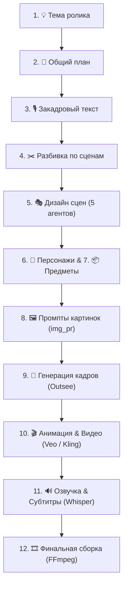

# 🎬 Video Pipeline (Studio & Autonomous Orchestration)

> **Автоматический модульный конвейер генерации коротких и длинных видеороликов (9:16 / 16:9)** с интерактивной **Веб-Студией**, HITL-контролем (Human-In-The-Loop), нейросетевыми агентами сценариев и надежной архитектурой с защитой от сбоев.

---

## 🌟 Возможности и Ключевые Архитектурные Решения

- 🎨 **Интерактивная Веб-Студия (Next.js 15 + Tailwind CSS):**
  - Визуальный граф пайплайна (Canvas Graph) с индикацией статусов и прогресса.
  - Пошаговый HITL-контроль: проверка и редактирование сценария, раскадровки, промптов и видео на каждом этапе.
  - Селекторы моделей ИИ для каждого узла генерации.
- ⚙️ **Единый источник истины (Database-First):**
  - SQLite + `aiosqlite` + `SQLAlchemy 2.0` — все шаги, кадры и артефакты синхронизируются в БД.
  - Экспорт и импорт в `project.xlsx` без потери состояния.
- 🤖 **Мультимодельный ИИ-Транспорт:**
  - **Текст/Сценарии:** GPT 5.5 / 5.6 Sol через VPS Relay, Kie Responses, Kimi K3 (TokenRouter).
  - **Изображения:** Outsee (Nano Banana 2, GPT Image 2), ComfyUI.
  - **Видео:** Veo 3.1 Lite/Fast, Kling 2.6 через Kie.
  - **Озвучка и субтитры:** ElevenLabs, faster-whisper, edge-tts.
- 🛡️ **Надежность промышленного уровня (Fault-Tolerance):**
  - **Защита от потери данных:** автоматический бэкап готовых сцен и видео в `data/.../old/scenes/` перед любыми сбросами.
  - **Умное восстановление:** автоснятие залипших блокировок (`img_gen_inflight`) при разрыве связи.
  - **Бесшовный Fallback хостинга:** автоматическое переключение на публичные хранилища (Litterbox/Catbox/Uguu), если Yandex Cloud S3 не сконфигурирован.
  - **Устойчивый статус проекта:** монотонная прогрессия статусов без ложных откатов назад.

---

## 📐 Схема Пайплайна



---

## 🛠️ Стек Технологий

| Компонент | Технологии |
| :--- | :--- |
| **Бэкенд** | Python 3.11+, FastAPI, SQLAlchemy 2.0, aiosqlite, Pydantic v2, Loguru |
| **Фронтенд** | Next.js 15 (App Router), React 19, TypeScript, Tailwind CSS, Lucide Icons |
| **Интеграции** | Outsee API, Kie API, ElevenLabs, faster-whisper, FFmpeg |
| **Оркестрация** | Внутренний State Machine оркестратор, Event Bus (SSE / WebSocket) |

---

## 🚀 Быстрый Старт

### 1. Установка окружения

```bash
# Клонирование и настройка Python
python -m venv .venv
.\.venv\Scripts\activate          # (на Windows)
pip install -e ".[dev]"

# Установка зависимостей интерфейса
cd web
npm install
npm run build
cd ..
```

### 2. Настройка переменных окружения

Скопируйте шаблон `.env.example` в `.env`:
```bash
cp .env.example .env
```
Заполните необходимые API-ключи:
* `GPT_RELAY_TOKEN` / `VIBECODE_API_KEY` — для доступа к языковым моделям.
* `OUTSEE_TOKEN` / `KIE_API_KEY` — для генерации картинок и видео.
* `YANDEX_STORAGE_*` — (опционально) для хранения референсов (при отсутствии автоматически используется бесплатный fallback).

### 3. Запуск Студии

**На Windows:**  
Просто запустите файл `STUDIO.cmd` в корне папки и выберите пункт `[1] Запуск студии`.

**Через консоль:**
```bash
python scripts/studio.py
```
Студия откроется в браузере по адресу: **`http://localhost:8765`**

---

## 🧪 Запуск Тестов

В проекте настроена автоматическая система модульного и сквозного тестирования:

```bash
pytest
```

Для проверки ключевых сценариев стабильности:
```bash
pytest tests/test_e2e_incident_fixes.py tests/test_project_state_regression.py tests/test_safe_image_wipe_backup.py
```

---

## 📂 Структура Проекта

```
video-pipeline/
├── app/
│   ├── orchestrator/       # Движок шагов и воркеров пайплайна
│   ├── services/           # Бизнес-логика (парсинг, БД, синхронизация, бэкапы)
│   ├── bots/               # Клиенты ИИ-провайдеров (Outsee, Kie, Yandex S3, GPT)
│   ├── models.py           # Модели базы данных SQLAlchemy
│   └── web/                # FastAPI роутеры и эндпоинты Студии
├── web/                    # Next.js 15 веб-интерфейс Студии
├── prompts/                # Промпты для шагов и агентов дизайна сцен
├── tests/                  # Набор автоматических тестов (pytest)
├── scripts/                # Скрипты запуска, миграций и сборки версий
└── STUDIO.cmd              # Главный лаунчер для Windows
```