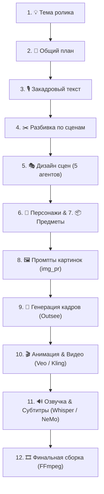

# 🎬 Video Pipeline (Studio & Autonomous Orchestration)

> **Автоматический модульный конвейер генерации коротких и длинных видеороликов (9:16 / 16:9)** с интерактивной **Веб-Студией**, HITL-контролем (Human-In-The-Loop), нейросетевыми агентами сценариев и надежной архитектурой с защитой от сбоев.

---

## 🌟 Возможности и Ключевые Архитектурные Решения

- 🎨 **Интерактивная Веб-Студия (Next.js 15 + Tailwind CSS):**
  - Визуальный граф пайплайна (Canvas Graph) с индикацией статусов и прогресса в реальном времени.
  - Пошаговый HITL-контроль: проверка и редактирование сценария, раскадровки, промптов, изображений и видео на каждом этапе.
  - Селекторы моделей ИИ для каждого узла генерации с автоматическим расчётом стоимости.
- ⚙️ **Единый источник истины (Database-First):**
  - Изолированная база данных на каждый проект (`project.db` на SQLite + `aiosqlite` + `SQLAlchemy 2.0`).
  - Двусторонняя синхронизация с `project.xlsx` без потери состояния и метаданных.
- 🤖 **Мультимодельный ИИ-Транспорт:**
  - **Текст/Сценарии:** GPT 5.5 / 5.6 Sol, Claude 3.7 / 5 Sonnet, Gemini 2.5 / 3.1 Pro, Grok 4.6 и другие модели через VPS Relay, Vibecode и Kie.
  - **Изображения:** Outsee (Nano Banana 2, GPT Image 2), ComfyUI.
  - **Видео:** Veo 3.1 Lite/Fast, Kling 2.6 через Kie.
  - **Озвучка и субтитры:** ElevenLabs, faster-whisper (CPU/GPU), NVIDIA NeMo Parakeet ASR.
- 🛡️ **Надежность промышленного уровня (Fault-Tolerance):**
  - **Защита от потери данных:** автоматический бэкап готовых сцен и видео в `data/.../old/scenes/` перед любыми сбросами шагов.
  - **Умное восстановление:** скользящий воркер генерации медиа, автоснятие залипших блокировок при разрыве связи.
  - **Бесшовный Fallback хостинга:** автоматическое переключение на публичные хранилища (Catbox/Litterbox/Uguu), если Yandex Cloud S3 не сконфигурирован.
  - **Устойчивый статус проекта:** монотонная прогрессия статусов без ложных откатов назад.

---

## 📐 Схема Пайплайна



---

## 🛠️ Стек Технологий

| Компонент | Технологии |
| :--- | :--- |
| **Бэкенд** | Python 3.11+, FastAPI, SQLAlchemy 2.0, aiosqlite, Pydantic v2, Loguru, uv |
| **Фронтенд** | Next.js 15 (App Router), React 19, TypeScript, Tailwind CSS, Lucide Icons (статический экспорт в `web/out`) |
| **Интеграции** | Outsee API, Kie API, ElevenLabs, faster-whisper, NVIDIA NeMo, FFmpeg |
| **Оркестрация** | State Machine оркестратор, Event Bus (SSE / WebSocket), Smart Polling |

---

## 🚀 Быстрый Старт на Windows (в 1 клик)

### 1. Первичная установка на новый ПК
Для запуска Студии на новом компьютере **не требуется** вводить команды в консоли или ставить Node.js:
1. Положите файл **`.env`** с вашими API-ключами в папку проекта (или рядом с файлом установки).
2. **Дважды кликните `SETUP.cmd`**.
3. Мастер установки сам:
   - Проверит наличие Python 3.11+ и FFmpeg (при отсутствии тихо подключит их).
   - За 30–45 секунд настроит виртуальное окружение через менеджер пакетов `uv`.
   - Проверит видеокарту и модуль распознавания речи (Whisper / NVIDIA).
   - Создаст на Рабочем столе фирменный ярлык **«Video Pipeline Studio»** с логотипом Студии.
   - Сразу запустит Студию в браузере.

### 2. Повседневный запуск
* **В 1 клик с Рабочего стола:** дважды кликните по ярлыку **«Video Pipeline Studio»** (бэкенд запустится автоматически, и откроется вкладка в браузере).
* **Через лаунчер в папке проекта:** дважды кликните **`STUDIO.cmd`** → нажмите `[1] Запуск студии`.
* **Адрес Студии:** [http://127.0.0.1:8765](http://127.0.0.1:8765)

### 3. Обновление кода
Чтобы получить последние обновления с GitHub без потери локальных настроек:
* Запустите `STUDIO.cmd` → выберите пункт **`[4] Обновить и запустить`**.
* Обновление автоматически подтянет свежий код с вашей ветки ПК (`main`, `Kir-updates`, `housepc` и др.), не затрагивая `.env` и данные проектов.

---

## 💻 Разработка и Linux / macOS

```bash
# Клонирование и создание окружения
git clone https://github.com/rohos228-spec/video-pipeline.git
cd video-pipeline
python3 -m venv .venv
source .venv/bin/activate        # (на Linux/macOS)

# Быстрая установка зависимостей
pip install uv
uv pip install -e ".[dev,whisper]"

# Настройка конфигурации
cp .env.example .env             # и укажите ваши ключи

# Запуск сервера разработки
python3 -m app.main
```
Студия откроется по адресу: **`http://127.0.0.1:8765`**

---

## 🧪 Запуск Тестов

В проекте настроена автоматическая система модульного и сквозного тестирования:

```bash
pytest
```

Для проверки ключевых сценариев стабильности:
```bash
pytest tests/test_e2e_incident_fixes.py tests/test_project_state_regression.py tests/test_safe_image_wipe_backup.py
```

---

## 📂 Структура Проекта

```
video-pipeline/
├── app/                        # Исходный код бэкенда FastAPI
│   ├── orchestrator/           # Движок шагов и воркеров пайплайна
│   ├── services/               # Бизнес-логика (парсинг, БД, синхронизация, бэкапы)
│   ├── bots/                   # Клиенты ИИ-провайдеров (Outsee, Kie, Yandex S3, GPT)
│   ├── models.py               # Модели базы данных SQLAlchemy
│   └── web/                    # FastAPI роутеры, SSE-события и эндпоинты Студии
├── web/                        # Веб-интерфейс Студии (Next.js 15)
│   ├── src/                    # React/TypeScript компоненты и канвас графа
│   └── out/                    # Готовый скомпилированный фронтенд (раздаётся бэкендом)
├── assets/                     # Графические ресурсы (фирменная иконка icon.ico)
├── prompts/                    # Промпты для шагов и агентов дизайна сцен
├── data/                       # Базы данных проектов и сгенерированные медиа-артефакты
├── scripts/                    # Скрипты установки, миграций, лаунчера и тестов
│   ├── setup.ps1               # Движок мастера быстрой установки
│   └── studio.ps1              # Движок консольного меню лаунчера
├── SETUP.cmd                   # Установщик в 1 клик для нового ПК
├── STUDIO.cmd                  # Главный лаунчер для Windows
├── create-desktop-shortcut.cmd # Утилита выноса ярлыка Студии на Рабочий стол
└── pyproject.toml              # Конфигурация зависимостей Python
```
