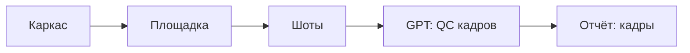

# Правила группы нод «Каркас → площадка → шоты + QC»

Файл собран из `app/services/node_rules.py` командой `python3 scripts/node_rules_doc.py`. Руками не править.

## Схема группы

## Что читает и пишет каждая нода

| Нода | Читает | Пишет GPT | Потом программа (правила) | Пишет программа |
|---|---|---|---|---|
| Каркас промт `prompts/scene_design/scene_skeleton_agent.md` | закадр | сцены: закадр, место, персонажи, предметы, речь, сцена; база_персонажей; предметы | R-UUID, R-BITS-REPAIR, R-BITS-SHAPE | биты |
| Площадка промт `prompts/scene_design/action.md` | закадр | площадка: зоны, предметы, проходы, люди; меняет | R-UUID, R-ACTION-FORMAT, R-ACTION-PLAN, R-ACTION-CHAIN | главное_действие; площадка |
| Шоты промт `scenes_to_frames_ru.md` | главное_действие, площадка, закадр | кадры: действие, объект, закадр, меняет, люди, камера, точность | R-UUID, R-SHOT-PARENT, R-SHOT-GRAMMAR, R-SHOT-VO-FILL, R-SCENE-PLAN, R-DOOR-STATE, R-DOOR-THRESHOLD, R-ALREADY-INSIDE, R-WALK-PROGRESS, R-PLAN-STEP, R-30DEG, R-SCREEN-DIRECTION, R-AXIS-180, R-FREEZE-PRECISE, R-LAYOUT, R-SHOT-COVERAGE | кадры: parent_id, закадр, план, линза_мм, ракурс, движение; кадры: раскладка, точность, старт, конец; площадка: выведено_кодом, исправлено_кодом |
| GPT: QC кадров промт `shots_qc_ru.md` | кадры, площадка, закадр | кадры (только нарушители) | R-UUID, R-SHOT-PARENT, R-SHOT-GRAMMAR, R-SHOT-VO-FILL, R-SCENE-PLAN, R-30DEG, R-FREEZE-PRECISE, R-LAYOUT, R-SHOT-COVERAGE | кадры: те же поля, что после «Шоты» |
| Отчёт: кадры | всё выше, дневник кадров | — | — | shots-report.html |

## Кто по очереди пишет одно поле

Последний в строке побеждает. Отсюда видно, где GPT и программа перетирают друг друга.

| Поле | Кто пишет по порядку |
|---|---|
| ракурс | GPT «Шоты» → R-SHOT-GRAMMAR → R-30DEG → GPT «QC» → R-SHOT-GRAMMAR → R-30DEG |
| план | GPT «Шоты» → R-SHOT-GRAMMAR → R-PLAN-STEP → GPT «QC» → R-SHOT-GRAMMAR → R-PLAN-STEP |
| закадр кадра | GPT «Шоты» → R-SHOT-GRAMMAR → R-SHOT-VO-FILL → GPT «QC» → R-SHOT-GRAMMAR |
| parent_id | GPT «Шоты» → R-SHOT-PARENT → GPT «QC» → R-SHOT-PARENT |
| точность / старт / конец | GPT «Шоты» → R-FREEZE-PRECISE → GPT «QC» → R-FREEZE-PRECISE |
| раскладка | R-LAYOUT (после каждой GPT-ноды кадров) |
| кадры (сколько) | GPT «Шоты» → R-SHOT-GRAMMAR → R-DOOR-THRESHOLD → GPT «QC» |
| главное_действие | main_action_from_bits_ru (вне цепочки) → R-ACTION-FORMAT |
| площадка | GPT «Площадка» → R-ACTION-PLAN → R-SCENE-PLAN |

## Правила

| ID | Правило | Простыми словами | Что делает | Ноды | Где живёт |
|---|---|---|---|---|---|
| R-UUID | Номер кадра вместо uuid | GPT иногда пишет номер кадра или uuid с опечаткой. Программа подставляет правильный uuid; ops с чужими uuid выбрасывает. | чинит | script, action, shots, qc | `app.services.db_apply:remap_frame_number_uuids` `app.services.db_apply:repair_near_miss_frame_uuids` |
| R-BITS-REPAIR | Биты: объект и якорь | Если в бите слоган вместо объекта или якорь не из закадра — программа берёт объект и кусок закадра сама. | чинит | script | `app.services.apply_ops_batches:repair_bits_ops` |
| R-BITS-SHAPE | Биты — список изменений | Биты должны быть списком по числу изменений в закадре, не одной строкой. Если нет — предупреждение, данные пишутся как есть. | предупреждает | script | `app.services.apply_ops_batches:bits_ops_reason` `prompt:templates/node_groups/script_frames_qc/script_writer_ru.md` |
| R-CHECK-SCRIPT | Проверка сценария | Только старые канвасы, где осталась нода проверки после каркаса. «Не ок» — каркас запускается заново, «Ок» — дальше к площадке. В новую группу проверка не входит. | останавливает | check_script | `app.services.node_groups:_script_frames_qc_group` |
| R-ACTION-FORMAT | Формат действия сцены | Главное действие пишется как «1. место — шаг → шаг». Если GPT забыл номер или скобки — программа дописывает. | чинит | action | `app.services.apply_ops_batches:auto_repair_action_chain_ops` `app.services.apply_ops_batches:repair_action_ops` |
| R-ACTION-PLAN | Площадка ячейки | Площадку (зоны, двери, проходы, люди по сторонам света) программа приводит к одному виду; чего нет — выведет позже на кадрах. | чинит | action | `app.services.apply_ops_batches:normalize_action_plan_ops` |
| R-ACTION-CHAIN | Действие — цепочка, не слоган | Главное действие — нумерованная цепочка шагов. Слоган вместо цепочки — предупреждение, пишется как есть. | предупреждает | action | `app.services.apply_ops_batches:action_chain_ops_reason` `prompt:templates/node_groups/script_frames_qc/main_action_from_bits_ru.md` |
| R-SHOT-PARENT | Главный кадр места | В одном месте первый кадр главный, остальные ссылаются на него (parent_id). GPT часто оставляет пусто — программа ставит. | чинит | shots, qc | `app.services.apply_ops_batches:repair_same_place_shot_parents` |
| R-SHOT-GRAMMAR | Грамматика кадров | Закадр: обычный кадр 26–80 симв.; перебивка 10–30 или короткий эмо/реакция (можно пустой). Не вали весь VO в один кадр. План, линза, ракурс, движение — из таблицы; недостающие шаги и вход в новое место дописываются из главного действия. | чинит | shots, qc | `app.services.scene_shot_grammar:apply_grammar_to_ops` `prompt:templates/node_groups/script_frames_qc/scenes_to_frames_ru.md` |
| R-SHOT-VO-FILL | Пустой закадр кадра | Перебивка может быть без закадра. Хвост текста ячейки код кладёт на покрывающий кадр (не копирует во все пустые). | чинит | shots, qc | `app.services.apply_ops_batches:repair_shot_vo_ops` |
| R-SHOT-COVERAGE | Кадры иллюстрируют закадр | Кадр — картина к смыслу своего куска закадра, без повторов. Нарушение — предупреждение, пишется как есть. | предупреждает | shots, qc | `app.services.apply_ops_batches:shots_coverage_ops_reason` `prompt:templates/node_groups/script_frames_qc/shots_qc_ru.md` |
| R-SCENE-PLAN | Площадка на кадрах | По плану площадки программа расставляет зоны, камеру и людей в каждом кадре и записывает, что вывела сама. | чинит | shots, qc | `app.services.apply_ops_batches:apply_scene_plan_ops` |
| R-DOOR-STATE | Закрытая дверь | Дверь, которая по плану ещё закрыта, в тексте не может быть «открытой». | чинит | shots, qc | `app.services.scene_plan:_Sim.check_doors` |
| R-DOOR-THRESHOLD | Проход через дверь | Сквозь закрытую дверь не пройти: программа вставляет кадр «открывает дверь» или открывает её в прошлом кадре. | чинит | shots, qc | `app.services.scene_plan:_Sim.check_doors` |
| R-ALREADY-INSIDE | Нельзя «уже внутри» | Герой не может сразу оказаться внутри — показывается вход через дверь. | чинит | shots, qc | `app.services.scene_plan:_Sim.check_entry_shown` |
| R-WALK-PROGRESS | Кто шёл — продвинулся | Если человек шёл, в следующем кадре он дальше по пути, а не на старом месте. | чинит | shots, qc | `app.services.scene_plan:_Sim.check_path` |
| R-PLAN-STEP | Смена крупности | Канон: ДАЛЬНИЙ|ОБЩИЙ|СРЕДНИЙ|СРЕДНЕ-КРУПНЫЙ|КРУПНЫЙ|ДЕТАЛЬ. Не два одинаковых подряд; запрет ОБЩИЙ↔СРЕДНИЙ и СРЕДНИЙ↔СРЕДНЕ-КРУПНЫЙ; не прыжок через 3+ ступени. | чинит | shots, qc | `app.services.scene_plan:_Sim.vary_shot_sizes` |
| R-30DEG | Правило 30° | При смене плана или том же объекте камера поворачивается минимум на 30°: другой ракурс или другая сторона. | чинит | shots, qc | `app.services.scene_plan:_Sim.vary_repeated_camera` `app.services.scene_plan:next_named_angle_30` |
| R-SCREEN-DIRECTION | Направление на экране | Кто бежал влево по экрану, бежит влево и в следующем кадре. | чинит | shots, qc | `app.services.scene_plan:_Sim.check_screen_direction` |
| R-AXIS-180 | Ось 180° | Двое держат свои стороны экрана: камера не перескакивает линию между ними. | чинит | shots, qc | `app.services.scene_plan:_Sim.check_axis` |
| R-LAYOUT | Раскладка кадра | Программа пишет раскладку: где что стоит, кто где, откуда камера и чем кадр отличается от прошлого. По ней пишутся промты картинок. | чинит | shots, qc | `app.services.scene_plan:_Sim.compile_layouts` |
| R-FREEZE-PRECISE | СТАРТ/КОНЕЦ у смены состояния / необратимости | Две картинки (старт/конец) — если меняется предмет/дверь, действие необратимо, или GPT дал разные старт·конец. Непрерывный процесс (идёт, говорит…) — одна картинка. Список глаголов — запасной сигнал. | решает | shots, qc | `app.services.scene_plan:freeze_decision` `prompt:templates/node_groups/script_frames_qc/scenes_to_frames_ru.md` |
| R-FREEZE-END-STILL | Конечная картинка и видео | После группы: у кадра СТАРТ/КОНЕЦ картинка конца ставится в очередь и идёт в видео последним кадром; второго клипа нет. | решает | после группы | `app.services.freeze_stills:seed_end_still_prompt` `app.services.freeze_stills:video_end_still` |
| R-ANALYTICS-COLLAPSE | Аналитика: разный закадр — разный смысл | Вне этой группы: если у разного закадра одинаковые смысл или место — пачка останавливается. | останавливает | другие ноды | `app.services.apply_ops_batches:analytics_ops_collapsed_reason` |
| R-PROMPTS-SHAPE | Промты картинок | Вне этой группы: нода промтов обязана вернуть промт_картинки, а не кадры. Иначе пачка останавливается. | останавливает | другие ноды | `app.services.apply_ops_batches:prompts_ops_reason` |

## Дневник кадра

Каждый вызов GPT в этой группе сохраняется в `data/videos/<проект>/node_trace/<нода>/<время>/`: вход, ответ GPT, ops до и после правок программы, `diary.jsonl` — что, где и по какому правилу поменяла программа. Отчёт группы показывает это по каждому кадру. Повтор без GPT: `python3 scripts/replay_node.py <папка прогона>`.
