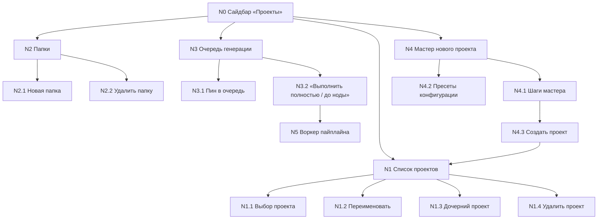

# База нод: меню «Проекты» (сайдбар Studio)

> Дата: 2026-08-17 · Формат: каждая кнопка/механика = нода с пояснением.
> Нода = {что видит юзер → что вызывает → что происходит дальше → когда ломается → связи}.
> Источники: `web/src/components/sidebar/*`, `app/web/routers/*`, `app/services/*`.
> Статусы дефектов — из [UI_BUTTON_AUDIT.md](UI_BUTTON_AUDIT.md).

## Граф нод

---

## N0. Сайдbar «Проекты» (корень)

- **Где:** левая панель Studio, `web/src/components/sidebar/project-sidebar.tsx`.
- **Что делает:** показывает папки и проекты, очередь генерации, вход в мастер.
- **Данные:** `GET /api/projects` + `GET /api/sidebar-layout` (файл `data/sidebar_layout.json`).
- **Ломается:** битый/несуществующий layout-файл → молча пустой layout (`_empty_layout`, warning в логе бэкенда; в UI выглядит как «всё пропало» — данные в БД целы).

## N1. Список проектов

### N1.1 Выбор проекта (клик по строке)
- **UI:** `project-sidebar.tsx:917` — строка проекта.
- **Механика:** локальный `onSelect` → проект открывается на канвасе; никакого API.
- **Связи:** → канвас (граф нод), → inspector.

### N1.2 Переименовать
- **UI:** контекстное меню проекта, `project-sidebar.tsx:1034`.
- **API:** `PATCH /api/projects/{id}` `{title}` → `projects.py:291`.
- **Механика:** меняет только title; slug и папка данных НЕ меняются (файлы остаются в `data/videos/<старое-slug>/`).
- **Ошибки:** toast onError.

### N1.3 Дочерний проект
- **UI:** `project-sidebar.tsx:1050`, кнопка с `disabled` пока идёт создание.
- **API:** `POST /api/projects/{id}/child` → `projects.py:220`.
- **Механика:** `project_child.create_child_from_parent` — копирует настройки/промты/gpt_text родителя; НЕ копирует закадр, Excel, картинки/видео. Новый slug, своя папка данных.
- **Когда:** «сделать ещё вариант той же серии» без ручной перенастройки.

### N1.4 Удалить проект
- **UI:** `project-sidebar.tsx:1069`, есть `confirm()`.
- **API:** `DELETE /api/projects/{id}` → `projects.py:278`.
- **Механика:** удаление из layout + `session.delete` (каскад по FK: кадры, артефакты, HITL, ячейки scene_design) + событие `project_deleted`. **Файлы на диске (`data/videos/<slug>/`) НЕ удаляются** — остаются сиротами.
- **Дефект (P2):** кнопка не `disabled` во время удаления — двойной клик = второй DELETE → 404 (ловится тостом, но мусорный вызов).

## N2. Папки

### N2.1 Новая папка
- **UI:** `project-sidebar.tsx:522` (иконка) → инлайн-форма `:574`.
- **API:** `POST /api/sidebar-layout/folders` `{name}` → `sidebar_layout.py`.
- **Механика:** папка = запись в `data/sidebar_layout.json` (folders[]); проекты привязываются через `project_layout[project_id].folder_id`.
- **Защита:** disabled + isPending + toast.

### N2.2 Удалить папку
- **UI:** `project-sidebar.tsx:717`.
- **API:** `DELETE /api/sidebar-layout/folders/{id}`.
- **Механика:** confirm с подсчётом проектов внутри; проекты НЕ удаляются — слетают в «без папки».

## N3. Очередь генерации

### N3.1 Пин в очередь (кружок у проекта)
- **UI:** `project-sidebar.tsx:936`.
- **API:** `POST /api/sidebar-layout/gen-queue/toggle` `{project_id}` → `sidebar_layout.py:118`.
- **Механика:** `toggle_gen_queue` — нет в очереди → добавить в конец; есть → снять, остальные сдвигаются. Очередь хранится в layout-файле (`gen_queue: [project_id…]`).
- **Связи:** → N5 (воркер читает очередь каждый тик).

### N3.2 «Выполнить полностью» / «до ноды»
- **UI:** `gen-queue-dialog.tsx:158` / `:185`.
- **API:** `POST /api/sidebar-layout/gen-queue/enqueue` `{project_id, mode, target_node_key?}` → `sidebar_layout.py:191`.
- **Механика:** режим `full` — гнать до конца пайплайна; `до ноды` — остановиться на target-ноде. Воркер берёт top-N окна (`WORKER_MAX_PARALLEL`), paused/user_stop слоты пропускаются (не блокируют хвост).
- **Связи:** → N5, → статусы проекта на канвасе.

## N4. Мастер нового проекта

### N4.1 Шаги мастера
- **UI:** `new-project-wizard.tsx` — тема, hero-режим, auto_mode, папка.
- **Механика:** локальный state до финального шага; валидации на каждом «Далее».

### N4.2 Пресеты конфигурации
- **UI:** `new-project-wizard.tsx:354-363`.
- **API:** `GET/POST/DELETE /api/generation-config-presets` → `config_presets.py`.
- **Дефект (P1):** удаление пресета одним кликом без confirm.

### N4.3 Создать проект
- **UI:** `new-project-wizard.tsx:530`.
- **API:** `POST /api/projects` `{title, hero_mode, auto_mode, sidebar_folder_id}` → `schemas.py:92`; затем опц. `PATCH` + сохранение пресета.
- **Механика:** создаётся Project + папка `data/videos/<slug>/` + стартовый `project.xlsx` из шаблона; проект появляется в списке N1.
- **Защита:** `create.isPending` блокирует повтор.

## N5. Воркер (механика за очередью)

- **Где:** `app/main.py` `_run_worker_loop` (тик ~5с), `app/services/gen_queue.py`.
- **Что делает:** читает `gen_queue` из layout → окно top-N → `advance_project` по статусу проекта → авто-переходы `auto_advance` → harness-гейты.
- **Стоп/пауза:** STOP-флаг (`step_cancel`), пауза после ошибок (step_failure_policy, авто-резюм после sleep_until).
- **Связи:** читает N3; пишет статусы проекта (видны в N1 и на канвасе).

---

## Свод дефектов меню «Проекты» (из аудита)

| Нода | Статус | Дефект |
|---|---|---|
| N1.4 | P2 | Нет disabled при удалении — двойной клик → мусорный 404 |
| N4.2 | P1 | Удаление пресета без confirm |
| N0 | P2 | Битый layout-файл = молча пустой сайдбар (данные целы, вид пугает) |

## Что НЕ покрыто этой базой (следующие части)

Канвас нод (Run/Wipe/V-меню), «База», «Монтаж», Create, «Промты», GPT-чат,
Оркестратор, HITL, Fleet — отдельные файлы по тому же формату.
