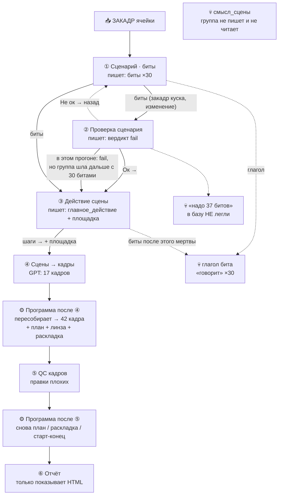

# Группа `script_frames_qc` — схема «кто что пишет»

Прогон-пример: ячейка `808538da` (Ткач, 30.09.2026).  
В базу попадает **не сырой ответ GPT**, а то, что осталось **после программы**.

---

## Главная схема потока



**Один вывод:** каркас ролика пишет **③ действие сцены**. Список кадров, план и раскладку ставит **программа**. Нода ④ только предлагает формулировки.

---

## Ноды как карточки (что входит → что выходит)

### ① Сценарий · биты

```
┌─────────────────────────────────────────────────────────┐
│  НОДА ①  Сценарий · биты                                │
│  промт: script_writer_ru.md                             │
├─────────────────────────────────────────────────────────┤
│  ЧИТАЕТ                                                 │
│    • закадр ячейки                                      │
│                                                         │
│  ПИШЕТ (GPT, потом лёгкий ремонт якоря/объекта)         │
│    • биты[] — в прогоне 30 штук                         │
│                                                         │
│  ПРИМЕР бита №1                                         │
│    изменение: «Сергей Ткач родился в Киселёвске…»       │
│    якорь:     «Ткач родился в Киселёвске»               │
│    глагол:    «говорит»                                 │
│    закадр:    кусок закадра ячейки                      │
└─────────────────────────────────────────────────────────┘
          │                         │
          │ живые поля              │ мёртвое
          ▼                         ▼
   закадр куска,              глагол «говорит»
   изменение  ──────► ③       ──────────────► никуда
   якорь ──► ② (проверка)     (кадры его не берут)
```

---

### ② Проверка сценария

```
┌─────────────────────────────────────────────────────────┐
│  НОДА ②  Проверка сценария                              │
│  (checkMode, своего файла промта нет)                   │
├─────────────────────────────────────────────────────────┤
│  ЧИТАЕТ          биты + закадр                          │
│  ПИШЕТ           вердикт Ок / Не ок                     │
│  НЕ ПИШЕТ        кадры, новые биты в базу               │
│                                                         │
│  ПРИМЕР этого прогона                                  │
│    вердикт:  fail                                       │
│    за что:   биты 2,5,19,28,30 склеивают мысли;         │
│              бит 4 превращает вопрос в утверждение      │
│    просила:  заменить на массив из 37 битов             │
└─────────────────────────────────────────────────────────┘
          │                         │
          │ по схеме                │ по факту прогона
          ▼                         ▼
   Не ок ─·─► назад на ①      «37 битов» ──► 💀 НЕ в базе
   Ок ──────► ③               действие пошло со СТАРЫМИ 30
                              + вердиктом fail
```

> **Критика:** проверка находит проблему и предлагает фикс, но **не кладёт** новый массив в базу. Следующая нода его не видит.

---

### ③ Действие сцены  ← **главный автор каркаса**

```
┌─────────────────────────────────────────────────────────┐
│  НОДА ③  Действие сцены                                 │
│  промт: main_action_from_bits_ru.md                     │
├─────────────────────────────────────────────────────────┤
│  ЧИТАЕТ          биты + закадр                          │
│  ПИШЕТ           главное_действие, площадка             │
│                                                         │
│  ПРИМЕР сцена 1                                         │
│    Место: следственный кабинет                          │
│    1. оперативники заполняют доску схемами…             │
│    2. Ткач снимает отпечатки…                           │
│    3. следователь размечает схему…                      │
│    4. начальник кладёт требование…                      │
│    5. Ткач снимает перчатки и уходит…                   │
│    (+ в скобках куски закадра битов 1–4)                │
│                                                         │
│  В прогоне: 8 сцен, 8 зон площадки                      │
└─────────────────────────────────────────────────────────┘
          │
          │ ЭТО СЫРЬЁ ДЛЯ СПИСКА КАДРОВ
          ▼
   шаги через «→»  ═══════════►  программа на ноде ④
   площадка (зоны, люди) ═════►  камера / раскладка
   биты после этого ──────────► 💀 больше никто не читает
```

---

### ④ Сцены → кадры  +  ⚙️ программа (кто реально побеждает)

```
┌─────────────────────────────────────────────────────────┐
│  НОДА ④  Сцены → кадры          GPT дала 17 кадров      │
│  промт: scenes_to_frames_ru.md  (оборвалась на сцене 5) │
├─────────────────────────────────────────────────────────┤
│  ЧИТАЕТ   главное_действие, площадка, закадр            │
│  GPT пишет (пример кадр 1):                             │
│    id: 1-S1-K1                                          │
│    место: следственный кабинет                          │
│    действие: оперативники у столов заполняют доску…     │
│    объект: место                                        │
│    люди: оперативники, центр, лицом на север            │
│    план:  ❌ GPT не писал                               │
└──────────────────────┬──────────────────────────────────┘
                       │
                       ▼
┌─────────────────────────────────────────────────────────┐
│  ⚙️ ПРОГРАММА сразу после ④  — ПОБЕДИТЕЛЬ СПИСКА        │
│                                                         │
│  1. Берёт шаги из ③ → строит СВОЙ список кадров         │
│  2. Новое место → вставка «общий вид {место}: кто стоит»│
│  3. Склеивает с GPT: шаг совпал → текст GPT,            │
│     нет шага у GPT → шаг из действия                    │
│  4. По «объект» (или словам действия) ставит:           │
│       план / линзу / ракурс                             │
│  5. Пишет раскладку (кто слева, дверь, отличие)         │
│  6. Точный жест → старт + конец; процесс → одна картина │
│                                                         │
│  ИТОГ: 42 кадра в базе (не 17)                          │
│  Сцены 6–8 целиком из шагов ③ + шаблоны «общий вид»     │
│  Дубли id: 1-S1-K1, K3, K5 по два раза                  │
└─────────────────────────────────────────────────────────┘
```

**Крупность — не сцена, таблица программы:**

| объект (или слово в действии) | план        |
|-------------------------------|-------------|
| место, «общий вид»            | ОБЩИЙ       |
| тело, двое                    | СРЕДНИЙ     |
| взгляд                        | СРЕДНЕ-КРУПНЫЙ |
| лицо                          | КРУПНЫЙ     |
| предмет («папка»…)            | ДЕТАЛЬ      |
| не нашла                      | тело → СРЕДНИЙ |

```
  раскладка ──► отчёт, промт картинки
               (кадр уже выбран; раскладка его НЕ создаёт)
```

---

### ⑤ QC кадров

```
┌─────────────────────────────────────────────────────────┐
│  НОДА ⑤  QC кадров                                      │
│  промт: shots_qc_ru.md                                  │
├─────────────────────────────────────────────────────────┤
│  ЧИТАЕТ    кадры, площадка, закадр                      │
│  ПИШЕТ     правки только плохих кадров                  │
│  В прогоне почти не меняла сюжет                        │
│  ⚙️ программа снова: раскладка, точность, старт/конец   │
└─────────────────────────────────────────────────────────┘
          │
          ▼
        тот же список кадров → ⑥
```

---

### ⑥ Отчёт

```
┌─────────────────────────────────────────────────────────┐
│  НОДА ⑥  Отчёт                                          │
│  ЧИТАЕТ всё из базы + дневник                           │
│  ПИШЕТ  ничего в смысл ролика                           │
│  ДЕЛАЕТ HTML (shots-report.html)                        │
└─────────────────────────────────────────────────────────┘
```

---

## Что живое, что мёртвое (стрелки «идёт / не идёт»)

```
ПОЛЕ                    РОЖДАЕТСЯ     ИДЁТ ДАЛЬШЕ?
────────────────────────────────────────────────────────────
биты                    ①             → ② и ③, потом нет
глагол бита             ①             ✗ никуда
«37 битов» (правка)     ②             ✗ не в базе
главное_действие        ③             ✓ каркас списка кадров
площадка                ③             ✓ раскладка, двери, камера
кадры GPT (17)          ④             △ частично (если шаг совпал)
список 42 кадра         ⚙️ после ④    ✓ это то, что в базе
действие кадра          GPT или ③     ✓ отчёт, промт
объект                  GPT/словарь   ✓ выбор плана
план / линза / ракурс   ⚙️            ✓ промт картинки
раскладка               ⚙️            ✓ отчёт/промт, кадр не создаёт
старт / конец           ⚙️            ✓ только у точных жестов
смысл_сцены             никто         ✗ группа не трогает
закадр кадра            GPT→⚙️        ✓ озвучка (нарезка GPT часто выкинута)
```

---

## Мини-пример одного кадра «сквозь трубы»

```
закадр ячейки
    │
    ▼
① бит: «Ткач родился…» + глагол «говорит» ──► глагол умирает
    │
    ▼
② fail: «надо 37» ──► 37 умирают; остаются 30
    │
    ▼
③ сцена: кабинет → шаг «оперативники заполняют доску…»
    │
    ▼
④ GPT: 1 кадр про оперативников (без плана)
    │
    ▼
⚙️ программа: объект «место» → план ОБЩИЙ,
   раскладка «оперативники центр, лицом на север…»,
   список раздут до 42
    │
    ▼
⑤ QC: сюжет почти тот же; ⚙️ снова раскладка
    │
    ▼
⑥ HTML-отчёт
```

---

## Критика и слабые места

| # | Что не так | Почему плохо | Факт прогона `808538da` |
|---|------------|--------------|-------------------------|
| 1 | Две «головы» пишут «что происходит» | ③ уже дала шаги; ④ пересказывает; побеждает код | GPT 17 → в базе 42 |
| 2 | Проверка не чинит то, что нашла | Пишет «37 битов», в базу не кладёт | действие со старыми 30 + fail |
| 3 | Список кадров = слова `→`, не ответ ④ | Нода может оборваться — код допишет шаблон | сцены 6–8 целиком из шагов + «общий вид» |
| 4 | Крупность — словарь, не режиссура | «папка»→дета́ль, «место»→общий даже если кадр про людей | объект «место» у кадра про оперативников → ОБЩИЙ |
| 5 | Одинаковые id | Склейка GPT↔шаг не узнаёт тот же жест | два `1-S1-K1`, два `K3`, два `K5` |
| 6 | План и раскладка пишутся дважды | После ④ и снова после ⑤ | дневник раздувается, сюжет тот же |
| 7 | Биты после ③ мертвые | Ошибки проверки уже не влияют на картинку | fail не изменил сцены |

### Нелогично (коротко)

1. Нода ④ по промту **не должна** писать план — крупность всё равно появляется от **программы** по объекту.  
2. Нода ④ выглядит автором списка — автор списка **программа**, сырьё — шаги **③**.  
3. «Общий вид: кто стоит в кадре» нет ни в закадре, ни у GPT — вставка кода на смену места.  
4. Проверка говорит «не ок» и предлагает массив, который **следующая нода не видит**.  
5. Раскладка описывает кадр так, будто она его придумала — кадр к этому моменту уже выбран.

---

## Если нужен один абзац

**Каркас** = нода **③ действие сцены**.  
**Формулировки и люди** = нода **④** (частично).  
**Список кадров, план, линза, раскладка** = **программа**.  
**Проверка и «глагол» бита** в картинку **не попадают**, если группу не вернули на сценарий.

Источник правил: `docs/NODE_GROUP_RULES.md`, код `app/services/`.
